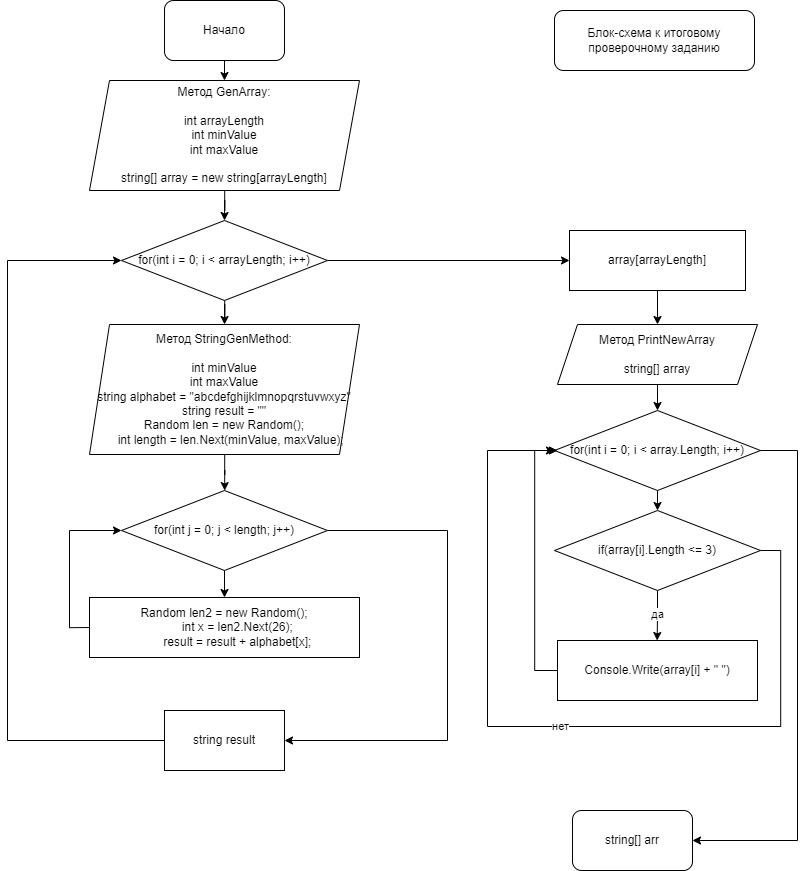

# Итоговая проверочная работа
Задача: 
Написать программу, которая из имеющегося массива строк формирует массив из строк, 
длина которых меньше либо равна 3 символа. Первоначальный массив можно ввести с клавиатуры, либо задать на старте выполнения алгоритма. При решении не рекомендуется пользоваться коллекциями, лучше обойтись исключительно массивами.

Решение. Для выполнения задания напишем несколько методов:
1. Метод ReadData для общения с пользователем. Метод запрашивает входные значения верхней и нижней границы длины строки у пользователя, а также длину самого массива строк,  который будет сгенерирован.
2. Метод StringGenMethod для генерации строки псевдослучайного размера. Метод получает на вход значения верхней и нижней границы длины строки и в указанном промежутке генерирует строку из символов введеной переменной "alphabet" (алфавит, 26 символов английского алфавита).
3. Метод GenArray необходим для создания массива с заданной длиной и наполнения его случайными строками, созданными методом StringGenMethod.
4. Метод PrintArray получает на вход сгенерированный массив и выводит его на экран при наличии соответствующих команд в программе 
5. Метод PrintNewArray получает на вход сгенерированный массив и выводит массив строк длина которых не превышает 3 символов.
6. Блок-схема процесса: 

